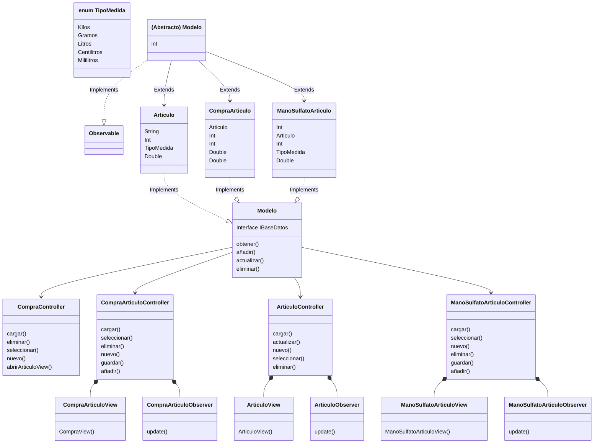
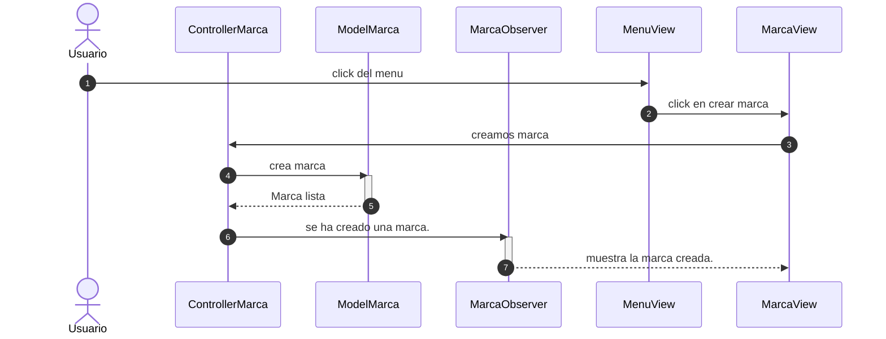

---
## Descripcion tecnica:

**Aplicación para la gestión fitosanitaria en cultivos de uva.**

*El objetivo principal de esta aplicación será:*
+ Gestión de marcas y productos fitosanitarios
+ Gestión de compras
+ Gestión de manos de sulfato
+ Control de costes.
+ Control de stock.
+ Control de cantidades aplicadas.
----

---
## Diagrama de clases:

---

## Diagrama de secuencia.
